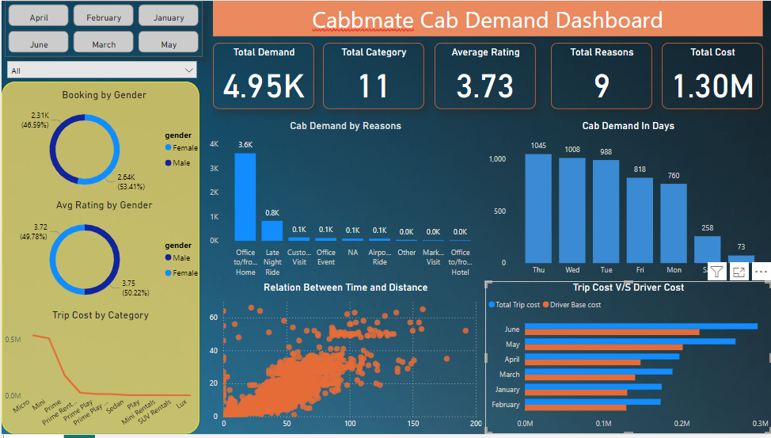

# Cabbmate-Cab-Demand-Dashboard
Exciting News! Introducing My Latest Project: Cabbmate Cab Demand Dashboard
Hello everyone! I hope you're all doing well.
I’m thrilled to share my latest project, the Cabbmate Cab Demand Dashboard, crafted using the powerful tools in Power BI. This dashboard provides deep insights into cab demand and driver costs, highlighting key metrics such as Total Demand, Avg Rate, Total Reasons, and Total Cost.
Here’s what’s included:
Matrix Chart: Features a Pie Chart showing Booking by Gender and a Column Chart illustrating Cab Demand by Reasons, all connected through two slicer for easy filtering.
Pie Chart: Showcasing Avg Rate by Gender.
Scatter Plot: Illustrating the relationship between time and distance.
Bar Charts: Trip Cost vs. Driver Cost and Cab Demand by Days.
Line Chart: Trip Cost by Category.
The project started by creating dummy data with Python, followed by data cleaning, organizing, and transforming it into actionable insights. The use of slicers makes the dashboard interactive and user-friendly.
I’d love for you to check it out and share your thoughts! Feedback and suggestions are always welcome.

